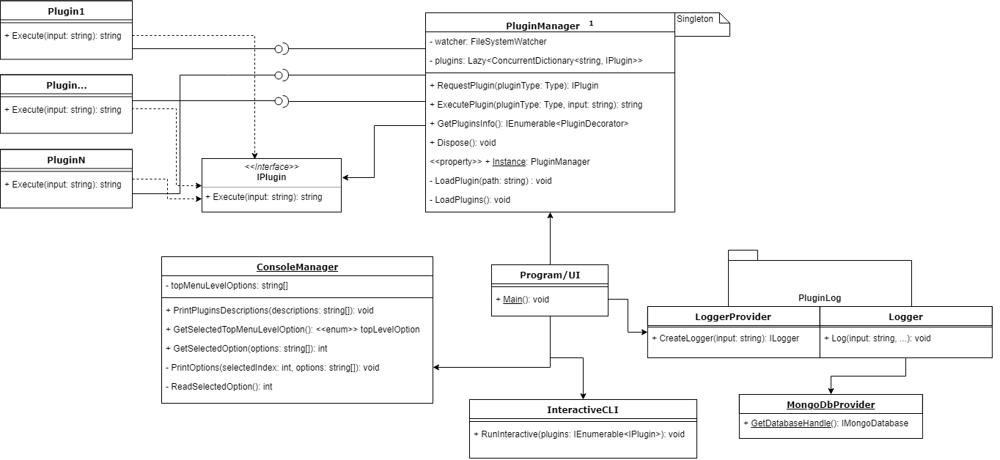

# PlugApp

## Requirements
Installed mongoDB for logging:

mongodb://localhost:27017

Existing collection "ActivityLog" in database "pluginApp"

## Supported platforms
Required: Windows, other optional

## Framework and lang
.NET Core 2.0.x, C# 7.1

## Plugin definition/interface (PluginShared.csproj)

IPlugin definition which contains Execute method. It defines the contract to which every plugin provider must submit.

## Plugin manager/provider (PluginCore.csproj)

Singleton responsible for creation, access and control over plugins. Also responsible for proxing calls executed on plugins.

Plugin manager will keep collection of available plugins in system and will be responsible for disovering new plugins that would be added at runtime.

Plugin manager will facilitate two types of plugin objects instatiation - creation must support both creation of plugin for each call and as a singleton.

## Main App/UI (PluginApp.csproj)

Module responsible for user interface, data presentation and enabling interaction with loaded plugins.

This module will not communicate directly with plugins in any way except for through plugin manager.
